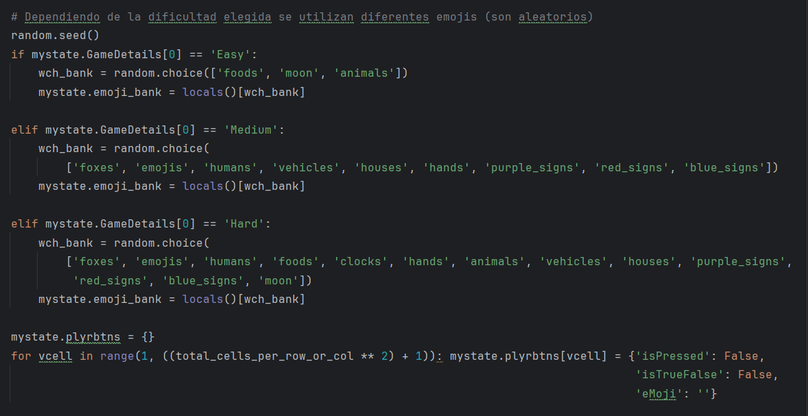
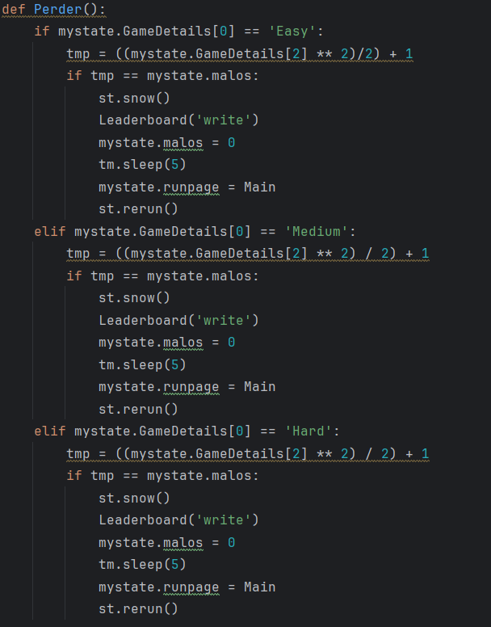

# Requistos vs código
## Requisitos Funcionales y Criterios de Aceptación

| Requisito y Criterios de Aceptación                                                                                                                                                                                                                                                                                                                                                                                                                                                                                                                                     | Código/Imagen                                                                                                                               |
|-------------------------------------------------------------------------------------------------------------------------------------------------------------------------------------------------------------------------------------------------------------------------------------------------------------------------------------------------------------------------------------------------------------------------------------------------------------------------------------------------------------------------------------------------------------------------|---------------------------------------------------------------------------------------------------------------------------------------------|
| **1. Configuración de Nivel de Dificultad** **Requisito:** El sistema debe permitir a los jugadores seleccionar el nivel de dificultad antes de comenzar el juego. **Criterios de Aceptación:** - Opciones de dificultad fácil, medio y difícil disponibles para selección. - La configuración de dificultad debe influir en la mecánica del juego, como la frecuencia de regeneración de imágenes y la puntuación. - Tiempos de regeneración específicos:   - Fácil: cada 8 segundos.   - Medio: cada 6 segundos.   - Difícil: cada 5 segundos. |                                                                                                                      |
| **2. Inicialización del Tablero** **Requisito:** Al comenzar un juego, el sistema debe inicializar el tablero con un conjunto aleatorio de imágenes basado en la dificultad seleccionada. **Criterios de Aceptación:** - El tablero debe ser llenado con imágenes de emojis que corresponden a la dificultad elegida. - Ninguna imagen objetivo (emoji de la barra lateral) debe aparecer más de una vez en el tablero inicial. - La imagen objetivo debe ser seleccionada aleatoriamente y mostrada en la barra lateral.                                |                                                                                       |
| **3. Parametrización del Nombre del Jugador y País** **Requisito:** El sistema debe permitir a los jugadores ingresar su nombre y país antes de comenzar el juego. **Criterios de Aceptación:** - Debe existir un campo de texto para que los jugadores ingresen su nombre y país. - Es posible que los campos de nombre y país estén vacíos, pero en ese caso no se muestra el _Leaderboard_ - La información del jugador debe persistir durante la sesión de juego.                                                                                    | `Código para ingresar nombre y país`                                                                                                        |
| **4. Autogeneración y Rotación de Imágenes** **Requisito:** Las imágenes en la barra lateral y en el tablero deben regenerarse automáticamente después de un intervalo fijo, que varía según el nivel de dificultad seleccionado. **Criterios de Aceptación:** -Regeneración automática de imágenes: La regeneración debe tener lugar según el intervalo definido por la dificultad seleccionada. -Penalización de puntos: Cada regeneración de imágenes incurre en una penalización de puntos para el jugador.|                                                                                                                       | | Código/Imagen                                                                             |
| **5. Gestión de Interfaz de Usuario y Navegación** **Requisito:** La interfaz de usuario debe proporcionar una visualización clara del estado actual del juego, incluyendo puntuación, imágenes activas y un tablero interactivo. **Criterios de Aceptación:** -Claridad visual: La interfaz debe mostrar claramente la puntuación actual, imágenes en juego y el estado de las celdas del tablero. -Navegación fluida: El jugador debe poder navegar fácilmente entre la página inicial y el juego activo y reiniciar o comenzar un nuevo juego en cualquier momento.| Esta parte se evidencia en las zonas del codigo que se encargan de hacer todo lo visual como: `InitialPage()`, `ScoreEmoji()` o `NewGame()` |
| **6. Restriciones de Interacción de Celdas** **Requisito:** Cada celda del tablero solo puede ser seleccionada una vez por juego para evitar múltiples usos de la misma imagen para ganar puntos. **Criterios de Aceptación:** - Limitación de selección: Una vez que una celda es seleccionada, no debe poder ser utilizada nuevamente dentro del mismo juego.                                                                                                                                                                                                | `if mystate.plyrbtns[vcell]['isPressed'] == False:` dentro de la función `PressedCheck()`                                                   |
| **7. Implementación de la Función 'Perder el Juego'** **Requisito:** El sistema debe verificar si el número de errores cometidos por el jugador excede un límite permitido y terminar el juego si es necesario. **Criterios de Aceptación:** - Límite de errores: El juego debe finalizar cuando se supera el número máximo de errores permitidos. - Feedback visual y auditivo: Proporcionar una señal clara, como un efecto visual o sonido, cuando el juego termina por exceso de errores.                                                               |                                                                                                                        |

